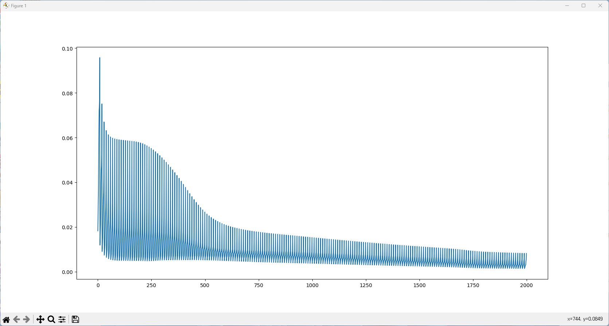
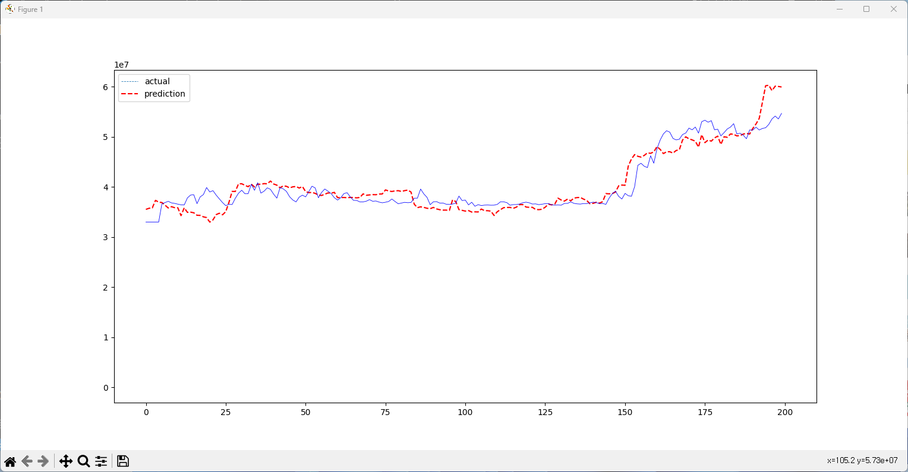
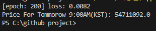

# Bitcoin Price Forcaster
RNN모델을 사용해서 비트코인의 가격을 예측해 보아요

## 어떤 요인을 고려했나요?
비트코인 가격의 결정요인: 한국시장에 대한 실증분석(이기광, 조수지, 민경수, 양철원)에 따르면 국내 비트코인의 가격은
현재의 가격, 거래량, 네이버 트랜드지수와 크게 연관이 있다고 분석되었어요. 따라서 이 세개의 요인을 학습시켜 내일의 가격을 예측하는 프로그램이에요.

## 어떤 라이브러리와 API를 사용했나요?
- 업비트 API
- 네이버 데이터랩 API
- torch
- numpy
- matplotlib

## 어떻게 동작하나요?
프로그램은 Data.py, Model.py, BitcoinForecaster.py 총 세개의 파일로 구성되어 있어요. 

#### Data.py
Data.py파일은 데이터를 불러오는 클래스가 있는 모듈이에요. coinData, trendData, Data 클래스로 구성되어 있어요
- coinData 클래스는 업비트 API를 틍해 최근 200일동안의 가격변동정보를 일단위로 불러와요. 업비트에서는 종가, 시가, 하한가, 상한가, 거래량을 제공해요. 이중에서 종가, 거래량만을 남겨서 반환해요.
- trendData 클래스는 네이버 데이터랩 API를 이용해 업비트에서 불러온 코인데이터와 같은 기간동안의 네이버 트랜드지수를 반환해요. 검색에 사용한 키워드는 '비트코인', '코인', '업비트' 세가지에요.
- Data 클래스는  coinData와 trendData를 상속받는 클래스에요. coinData와 trendData에서 불러온 데이터들을 하나의 텐서로 합쳐서 반환해요.

#### Model.py
이 파일에는 RNN모델을 구현한 클래스가 있어요.
- VanillaRnn클래스에는 Data클래스에서 제공하는 데이터를 이용하는 모델이 정의되어 있어요. 다음은 각 파라미터들에 관한 설명이에요
- input_size: 모델의 input사이즈
- hidden_size: 모델의 은닉층 사이즈
- num_layers: 모델의 레이어 층 수
- sequence_length: 만약 sequence_length가 5라면, 5일치의 데이터를 보고 6일차의 종가를 예측해요
- lr은 학습률, epoch는 에포크의 수를 나타내요. 각각 0.001과 200이 default값으로 설정되어있어요

#### BitcoinForecaster.py
이 파일을 실행시켜 프로그램을 실행시킬 수 있어요
- Data클래스의 인스턴스를 생성해 데이터들을 불러와요. seqence_length는 5, batch_size는 20으로 설정했어요.
- VanillaRnn클래스의 인스턴스를 생성해요. hidden_size는 8로 설정했어요
- plotLoss함수에서 학습을 진행하고, 학습을 진행하며 발생한 손실을 그래프화 해요.
- plotting함수에서 학습을 진행한 모델로 200일치의 예측값을 그래프화 해요. 빨간색 선은 실제 가격, 파란색 선은 모델의 예측값이에요. 첫 sequence_length만큼의 날은 예측을 할 데이터가 없기 때문에, 예측값이 존재하지 않아요.
- 최근 5일간의 가격 데이터를 가지고 모델이 내일의 비트코인 값을 예측해 출력해요.

## 실제 실행
BitcoinForecaster.py를 실제 실행하면 다음과 같은 창이 나와요.

학습을 진행하며 발생한 손실을 시각화 했어요.

실제 가격과 예측가격을 시각화 했어요.

콘솔 출력이에요. 내일 9시의 비트코인 가격을 54711092원으로 예측하고있어요.